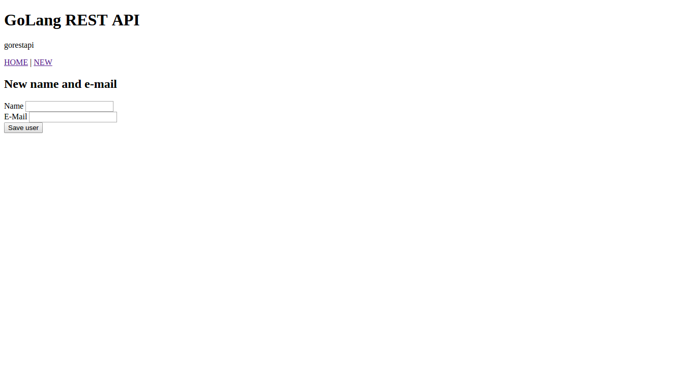
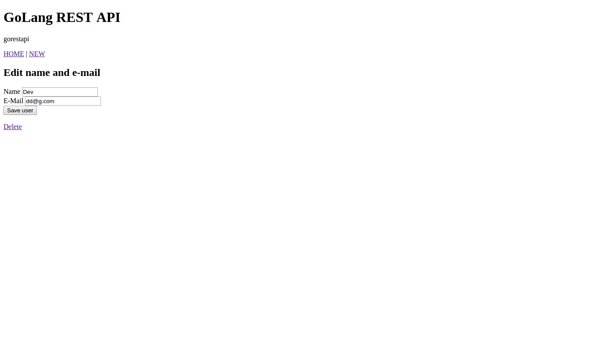
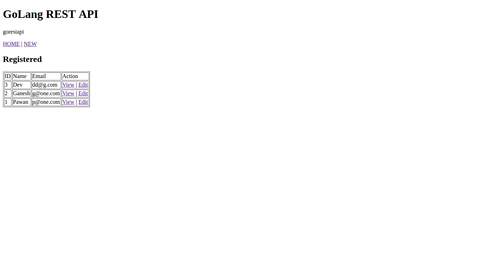
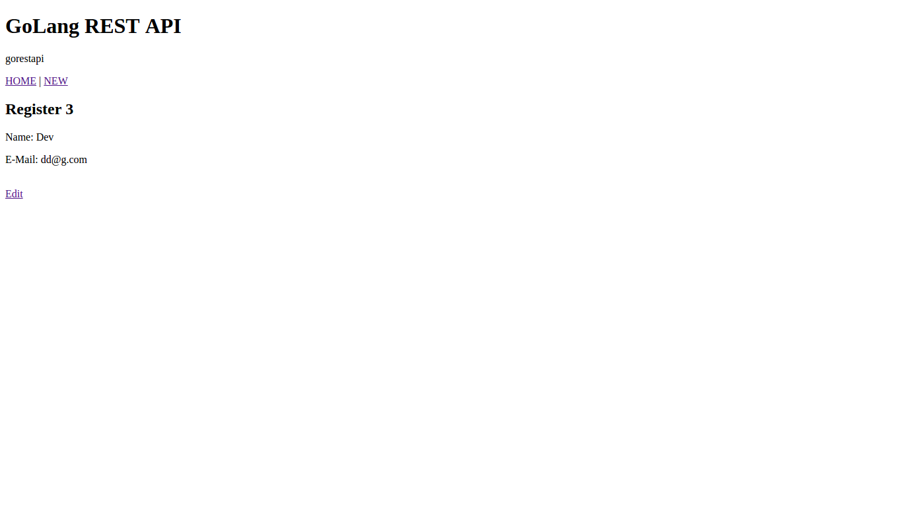

# GoLangRestApi
GoLangRestApi

---
[ Browser URL ]
- Server started on: http://localhost:9000

---
## Create
- Insert New Recored

## Update
- Edit

## Read
- Dashboard

- View by ID

## Delete
- Delete Recored

